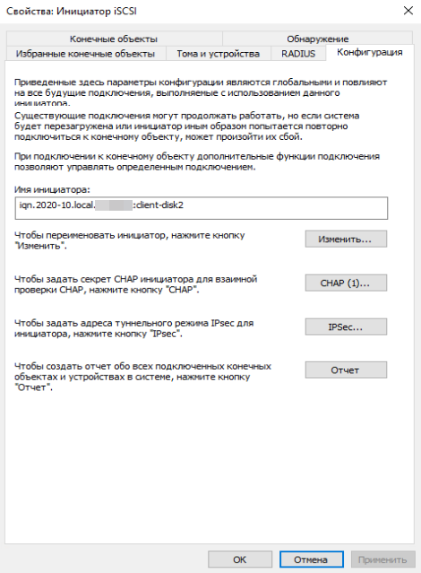
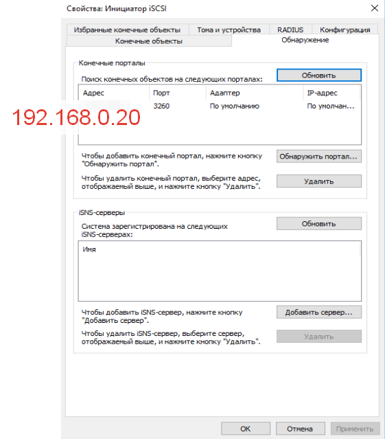
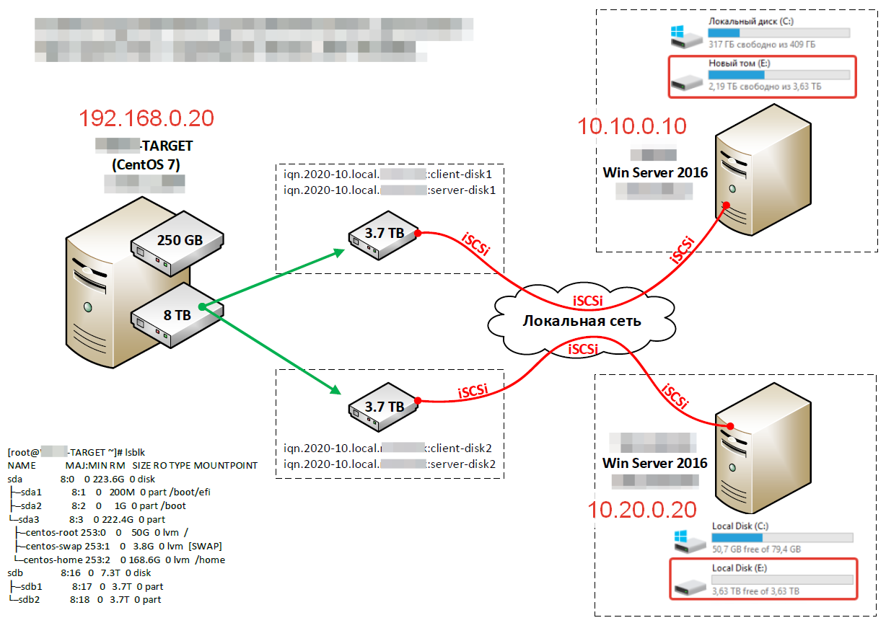

### iSCSi сервер на базе CentOS7 ###

---

Дано: линукс машина с двумя дисками
- 200GB - система
- 8Tb - делим на два для подсоединения к двум Win серверам по iSCSi

```shell
targetcli
cd /backstores/block
create disk1 /dev/sdb1
create disk2 /dev/sdb2
cd /
cd iscsi
create iqn.2020-10.local.noobank:server-disk1
create iqn.2020-10.local.noobank:server-disk2
```

#### ДЛЯ ПЕРВОГО ДИСКА:

```shell
cd iqn.2020-10.local.noobank:server-disk1
cd tpg1
cd acls
create iqn.2020-10.local.noobank:client-disk1

cd ..
cd luns
create /backstores/block/disk1
cd/
```

#### ДЛЯ ВТОРОГО ДИСКА:

```shell
cd iscsi
cd iqn.2020-10.local.noobank:server-disk2
cd tpg1
cd acls
create iqn.2020-10.local.noobank:client-disk2

cd ..
cd luns
create /backstores/block/disk2
cd/

cd /
saveconfig
exit 

systemctl restart target
systemctl enable target
```

---


---


---



---



---

##### Добавить в iptables порт TCP-3260


Имточник:
[![youtube]](https://www.youtube.com/watch?v=RqFWhZ-w-Dk)
