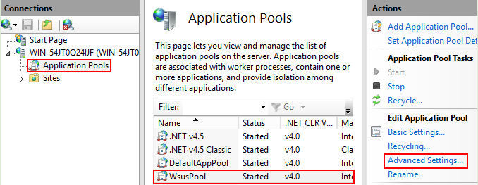
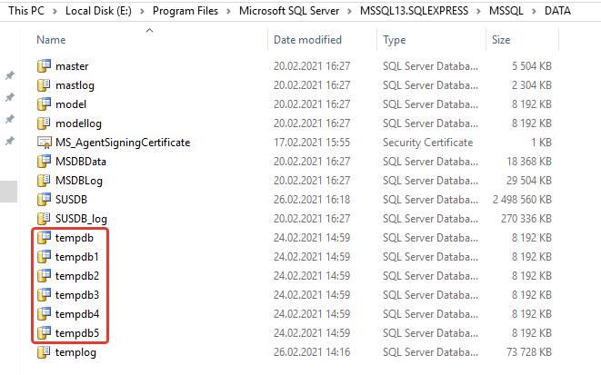

## Делаем быстрый WSUS


### Установка:
#### SQL
Для этого обязательно делаем установку в связке с базой SQL (express будет достаточно) вместо Windows Internal Database (WID)

### Оптимизация:
#### IIS
В конфигурации "по-умолчанию" пул приложений "WsusPool" настроен неоптимально. Давайте донастроим его. Для этого запустите оснастку IIS, откройте "Application pools", выберите WsusPool и откройте "Advanced settings":



По умолчанию процессу w3wp.exe выделяется мало памяти. Давайте уберем лимиты:

В поле "Private Memory Limit (KB)" установите в качестве лимита 0

При большом количестве клиентов WSUS, особенно получающих обновления впервые, рекомендуем увеличить следующие параметры:

1. В поле "Queue Length" установите значение 25 000 или даже 50 000 (по умолчанию там всего 1000).
2. Если у Вас используется NUMA, в поле "Maximum Worker Processes" поставьте значение 0 (по умолчанию 1). Если Вы не знаете, поддерживает ли сервер NUMA, оставьте значение по умолчанию.
3. В поле ""Service Unavailable" Response Type" поставьте значение TcpLevel (по умолчанию - HttpLevel).
4. В поле "'Failure Interval (minutes)" поставьте значение 30 (по умолчанию 5).
5. В поле "Maximum Failures" поставьте значение 60 (по умолчанию 5)

После изменения настроек перезагрузите сервер или только IIS. Для перезагрузки IIS выполните в командной строке от имени администратора:
iisreset

#### TempDB

Настройте базу TempDB: укажите количество файлов базы данных равным количеству [логических] процессоров на SQL сервере. Если количество процессоров больше 8, используйте 8 файлов в базе данных TempDB.
Microsoft рекомендует:
> As a general rule, if the number of logical processors is less than or equal to 8, use the same number of data files as logical processors. If the number of logical processors > is greater than 8, use 8 data files and then if contention continues, increase the number of data files by multiples of 4 (up to the number of logical processors) until the  contention is reduced to acceptable levels or make changes to the workload/code.

Например, на 6 ядер будет так:



### Очистка WSUS
Для того, чтобы почистить WSUS (чтобы он начал работать или заработал быстрее), есть несколько средств:

1. Штатные средства консоли Windows Server Update Services.
2. Дефрагментация / реиндексация базы данных WSUS.
3. Ускорение работы WSUS с помощью чистки/оптимизации базы данных.
4. Удаление устаревших / ненужных обновлений из командной строки.
5. Проверка и исправление испорченных файлов обновлений WSUS.

Применять все эти средства рекомендуем по порядку: они перечислены в порядке от более слабых к более сильным средствам.

#### Штатные средства очистки в консоли Windows Server Update Services
Для чистки WSUS стандартными средствами:

1. Откройте консоль Windows Server Update Services
2. Выберите "Options" => "Server Cleanup Wizard"
3. Отметьте все пункты для очистки:
    1. Unused updates and update revisions
    2. Computers not contacting the server
    3. Unneeded update files
    4. Expired updates
    5. Superseded updates
4. Нажмите Next и выполните очистку всех указанных пунктов

Главный секрет состоит в том, что запускать Server Cleanup Wizard со всеми пунктами необходимо регулярно, не реже одного раза в месяц (или при одобрении большой пачки обновлений). Одобрили свежую пачку обновлений — очистите сервер. Если этого не делать, мастер прекращает нормально работать. После запуска он висит несколько часов, после чего консоль "падает" с ошибкой.

Для решения проблемы можно попробовать запускать каждый из перечисленных пунктов в Server Cleanup Wizard по отдельности. Если же и это не помогает, нужно переходить к другим средствам оптимизации WSUS.


### Ускорение работы WSUS с помощью чистки/оптимизации базы данных
Несколько советов, которые могут во многих случаях значительно ускорить сервер.

1. Очистка базы
2. Переиндексация
3. Настройка TempDB

#### Очистка базы
Для очистки базы выполните 4 волшебные команды:

Отклонение "просроченных" обновлений:
```sql
EXEC SUSDB.dbo.spDeclineExpiredUpdates;1
```

Отклонение "устаревших" обновлений (взамен которых вышли другие обновления):
```sql
EXEC SUSDB.dbo.spDeclineSupersededUpdates;1
```

"Сжатие" обновлений (для команды spCompressUpdate используется "обертка"):
```sql
USE SUSDB
DECLARE @var1 INT, @curitem INT, @totaltodelete INT
DECLARE @msg nvarchar(200)
CREATE TABLE #results (Col1 INT) INSERT INTO #results(Col1)
EXEC spGetUpdatesToCompress
SET @totaltodelete = (SELECT COUNT(*) FROM #results)
SELECT @curitem=1
DECLARE WC Cursor FOR SELECT Col1 FROM #results
OPEN WC
FETCH NEXT FROM WC INTO @var1 WHILE (@@FETCH_STATUS > -1)
BEGIN SET @msg = cast(@curitem as varchar(5)) + '/' + cast(@totaltodelete as varchar(5)) + ': Compressing ' + CONVERT(varchar(10), @var1) + ' ' + cast(getdate() as varchar(30))
RAISERROR(@msg,0,1) WITH NOWAIT
EXEC spCompressUpdate @localUpdateID=@var1
SET @curitem = @curitem +1
FETCH NEXT FROM WC INTO @var1
END
CLOSE WC
DEALLOCATE WC
DROP TABLE #results
```

Удаление отклоненных обновлений (для команды spDeleteUpdate используется такая же "обертка"):
```sql
USE SUSDB
DECLARE @var1 INT, @curitem INT, @totaltodelete INT
DECLARE @msg nvarchar(200)
CREATE TABLE #results (Col1 INT) INSERT INTO #results(Col1)
EXEC spGetObsoleteUpdatesToCleanup
SET @totaltodelete = (SELECT COUNT(*) FROM #results)
SELECT @curitem=1
DECLARE WC Cursor FOR SELECT Col1 FROM #results
OPEN WC
FETCH NEXT FROM WC INTO @var1 WHILE (@@FETCH_STATUS > -1)
BEGIN SET @msg = cast(@curitem as varchar(5)) + '/' + cast(@totaltodelete as varchar(5)) + ': Deleting ' + CONVERT(varchar(10), @var1) + ' ' + cast(getdate() as varchar(30))
RAISERROR(@msg,0,1) WITH NOWAIT
EXEC spDeleteUpdate @localUpdateID=@var1
SET @curitem = @curitem +1
FETCH NEXT FROM WC INTO @var1
END
CLOSE WC
DEALLOCATE WC
DROP TABLE #results
```

Во время работы "обёрток" клиенты прекращают получать обновления. Вы можете в любой момент прервать выполнение скрипта без потери прогресса. Для того, чтобы продолжить процесс, не забудьте удалить временную таблицу:

```sql
DROP TABLE #results
```
В мастере очистки WSUS 5 команд, мы вполнили 4 из них. Команду "Delete computers not contacting server" следует выполнить из мастера.

#### Переиндексация базы
Для переиндексации базы используйте следующий скрипт:
```sql
/****************************************************************************** 
This sample T-SQL script performs basic maintenance tasks on SUSDB 
1. Identifies indexes that are fragmented and defragments them. For certain 
   tables, a fill-factor is set in order to improve insert performance. 
   Based on MSDN sample at http://msdn2.microsoft.com/en-us/library/ms188917.aspx 
   and tailored for SUSDB requirements 
2. Updates potentially out-of-date table statistics. 
******************************************************************************/ 
 
USE SUSDB; 
GO 
SET NOCOUNT ON; 
 
-- Rebuild or reorganize indexes based on their fragmentation levels 
DECLARE @work_to_do TABLE ( 
    objectid int 
    , indexid int 
    , pagedensity float 
    , fragmentation float 
    , numrows int 
) 
 
DECLARE @objectid int; 
DECLARE @indexid int; 
DECLARE @schemaname nvarchar(130);  
DECLARE @objectname nvarchar(130);  
DECLARE @indexname nvarchar(130);  
DECLARE @numrows int 
DECLARE @density float; 
DECLARE @fragmentation float; 
DECLARE @command nvarchar(4000);  
DECLARE @fillfactorset bit 
DECLARE @numpages int 
 
-- Select indexes that need to be defragmented based on the following 
-- * Page density is low 
-- * External fragmentation is high in relation to index size 
PRINT 'Estimating fragmentation: Begin. ' + convert(nvarchar, getdate(), 121)  
INSERT @work_to_do 
SELECT 
    f.object_id 
    , index_id 
    , avg_page_space_used_in_percent 
    , avg_fragmentation_in_percent 
    , record_count 
FROM  
    sys.dm_db_index_physical_stats (DB_ID(), NULL, NULL , NULL, 'SAMPLED') AS f 
WHERE 
    (f.avg_page_space_used_in_percent < 85.0 and f.avg_page_space_used_in_percent/100.0 * page_count < page_count - 1) 
    or (f.page_count > 50 and f.avg_fragmentation_in_percent > 15.0) 
    or (f.page_count > 10 and f.avg_fragmentation_in_percent > 80.0) 
 
PRINT 'Number of indexes to rebuild: ' + cast(@@ROWCOUNT as nvarchar(20)) 
 
PRINT 'Estimating fragmentation: End. ' + convert(nvarchar, getdate(), 121) 
 
SELECT @numpages = sum(ps.used_page_count) 
FROM 
    @work_to_do AS fi 
    INNER JOIN sys.indexes AS i ON fi.objectid = i.object_id and fi.indexid = i.index_id 
    INNER JOIN sys.dm_db_partition_stats AS ps on i.object_id = ps.object_id and i.index_id = ps.index_id 
 
-- Declare the cursor for the list of indexes to be processed. 
DECLARE curIndexes CURSOR FOR SELECT * FROM @work_to_do 
 
-- Open the cursor. 
OPEN curIndexes 
 
-- Loop through the indexes 
WHILE (1=1) 
BEGIN 
    FETCH NEXT FROM curIndexes 
    INTO @objectid, @indexid, @density, @fragmentation, @numrows; 
    IF @@FETCH_STATUS < 0 BREAK; 
 
    SELECT  
        @objectname = QUOTENAME(o.name) 
        , @schemaname = QUOTENAME(s.name) 
    FROM  
        sys.objects AS o 
        INNER JOIN sys.schemas as s ON s.schema_id = o.schema_id 
    WHERE  
        o.object_id = @objectid; 
 
    SELECT  
        @indexname = QUOTENAME(name) 
        , @fillfactorset = CASE fill_factor WHEN 0 THEN 0 ELSE 1 END 
    FROM  
        sys.indexes 
    WHERE 
        object_id = @objectid AND index_id = @indexid; 
 
    IF ((@density BETWEEN 75.0 AND 85.0) AND @fillfactorset = 1) OR (@fragmentation < 30.0) 
        SET @command = N'ALTER INDEX ' + @indexname + N' ON ' + @schemaname + N'.' + @objectname + N' REORGANIZE'; 
    ELSE IF @numrows >= 5000 AND @fillfactorset = 0 
        SET @command = N'ALTER INDEX ' + @indexname + N' ON ' + @schemaname + N'.' + @objectname + N' REBUILD WITH (FILLFACTOR = 90)'; 
    ELSE 
        SET @command = N'ALTER INDEX ' + @indexname + N' ON ' + @schemaname + N'.' + @objectname + N' REBUILD'; 
    PRINT convert(nvarchar, getdate(), 121) + N' Executing: ' + @command; 
    EXEC (@command); 
    PRINT convert(nvarchar, getdate(), 121) + N' Done.'; 
END 
 
-- Close and deallocate the cursor. 
CLOSE curIndexes; 
DEALLOCATE curIndexes; 
 
 
IF EXISTS (SELECT * FROM @work_to_do) 
BEGIN 
    PRINT 'Estimated number of pages in fragmented indexes: ' + cast(@numpages as nvarchar(20)) 
    SELECT @numpages = @numpages - sum(ps.used_page_count) 
    FROM 
        @work_to_do AS fi 
        INNER JOIN sys.indexes AS i ON fi.objectid = i.object_id and fi.indexid = i.index_id 
        INNER JOIN sys.dm_db_partition_stats AS ps on i.object_id = ps.object_id and i.index_id = ps.index_id 
 
    PRINT 'Estimated number of pages freed: ' + cast(@numpages as nvarchar(20)) 
END 
GO 
  
--Update all statistics 
PRINT 'Updating all statistics.' + convert(nvarchar, getdate(), 121)  
EXEC sp_updatestats 
PRINT 'Done updating statistics.' + convert(nvarchar, getdate(), 121)  
GO
```

"Ручная" переиндексация базы данных:

```sql
USE SUSDB;
-- делаем проверку базы данных:
DBCC CHECKDB(N'SUSDB')  
GO
-- Делаем переиндексацию базы данных:
sp_msforeachtable N'DBCC DBREINDEX (''?'')'
GO
-- обновляем статистику:
EXEC sp_updatestats
GO

DBCC FREEPROCCACHE
Go
```

### Удаление неиспользуемых патчей
Есть несколько команд, призванных решить проблему с удалением неиспользуемых патчей:

1. WSUSDebug PurgeUnneededFiles
2. WSUSUTIL.exe Deleteunneededrevisions
3. WSUSUTIL.exe Reset
4. WSUSUTIL.exe Removeinactiveapprovals (optional)

#### WSUSDebug PurgeUnneededFiles
WsusDebugTool.exe /Tool:PurgeUnneededFiles
wsusdebugtool отдельная утилита и скачивается отдельно (под ОС с архитектурой х64 не работает). Как следует из описания, удаляются файлы, которые не нужны серверу WSUS.
WSUS Debug Tool: Run PurgeUnneededFiles command to Purge unneeded content. This command deletes all files not needed on the WSUS server.

#### WSUSUTIL Deleteunneededrevisions
WSUSUTIL.exe Deleteunneededrevisions
Команда чистки метаданных устаревших / ненужных обновлений из СУБД. Обратите внимание: эта команда должна выполняться после остановки сайта WSUS в консоли IIS.
Purges the metadata for unnecessary update revisions from the database. This is useful for managing WSUS with an MSDE database. (NOTE: this command should only be run after stopping the Windows Server Update Services website in Internet Information Services MMC.)

#### wsusutil reset
Как выполнить процедуру WSUS Reset
WSUS Reset - это безопасная процедура, которая проводит проверку имеющихся файлов метаданных с информацией о них в БД WSUS, и при выявлении расхождений – исправляет проблему.
На сервере с ролью WSUS:

1. Закройте консоль WSUS;
2. Остановите службу Update Services;
3. Скопируйте содержимое папки WSUSContent в безопасное место, после чего удалите все содержимое;
4. Запустите службу Update Services;
5. В elevated командной строке перейдите в каталог "C:\Program Files\Update Services\Tools"
6. Запустите команду
```sql
WSUSUtil.exe RESET
```
Как проверить факт завершения процесса?
Вам нужно открыть лог SoftwareDistribution.log (по умолчанию расположен в каталоге "C:\Program Files\Update Services\LogFiles"), в нем должны появиться строки вида:

ExecutionContext.runTryCode State Machine Reset Agent Starting <– при начале сброса…
ExecutionContext.runTryCode State Machine Reset Agent Finished <– при завершении

Если последняя строка появилась в логе, то можно считать процедуру WSUS Reset выполненной и приступать к проверке работоспособности WSUS.
WSUSUTIL.exe Reset: Now that you have purged the content, use 'WSUSUTIL.exe reset' which checks that every metadata row in the database has corresponding content stored in the file system. If content is a missing or corrupted, WSUS downloads the content again.
WSUSUTIL.exe reset
***(NOTE: WSUSUTIL.exe is installed C:\Program Files\Update Services\Tools)
MOST IMPORTANT
The option "Download update files to this server only when updates are approved" must be checked / selected or else, it will re-download those "not needed" updates,during the next sychronization schedule.
Open WSUSAdmin Console – Click on "Options" – Click on "Synchronization Options" – Scroll down to "Update Files and Languages" Section – Click on "Advanced" – Click "OK" – Select "Download update files to this server only when updates are approved" – Click "OK" and save settings.

 
### Диагностика WSUS
#### Ошибка 80244022 при обновлении windows

Причина ошибки 80244022 - в том, что не запущен сервис обновлений, точнее служба обновлений при подключении к ней выдает ошибку. При попытке открытия сайта (wsus = имя сервера WSUS):
http://wsus:8530/
Выдается сообщение:
Service Unavailable HTTP Error 503. The service is unavailable.

При этом не удается запустить консоль управления WSUS. Перезагрузка службы "WSUS service" не помогает, помогает только перезагрузка IIS и/или всего сервера (это помогает ненадолго).

Причиной зависания службы являются события в логах на сервере WSUS:

Event ID: 5117
Level: Information
Source: Microsoft-Windows-WAS
Description: A worker process serving application pool 'WsusPool' has requested a recycle because it reached its private bytes memory limit.

Event ID: 5002
Level: Error
Source: Microsoft-Windows-WAS
Description: Application pool 'WsusPool' is being automatically disabled due to a series of failures in the process(es) serving that application pool.

Более подробно - см. по этим ошибкам (event ID) - см. ниже по тексту.

Здесь приводятся неверные решения данной проблемы:

http://www.geek.giriblog.com/windows-error-80244022-solved.html
https://social.technet.microsoft.com/Forums/ru-RU/b30ebfc1-0fb1-48f0-b54c-b372a3aabc10/wsus-80244022-help?forum=wsusru

Правильное решение описано здесь:

http://answers.microsoft.com/en-us/windows/forum/all/windows-update-error-found-code-80244022/d025b9b5-f88d-4987-b6c1-218c2bac35bf

 
### Ошибка 80244023 при обновлении windows

Эта проблема связана прежде всего со следующей проблемой: не открывается (или открывается через раз) сайт (wsus = имя сервера WSUS):
http://wsus:8530/

Если при открытии главной web-страницы WSUS отображается ошибка 403:

1. зайдите на сервер WSUS
2. откройте IIS => Application pools => WSuspool
3. проверьте, что версия .NET указана 4.0:
wsuspool => basic settings => .NET CLR version = 4.0.xxxx
 

#### Service Unavailable
При попытке открытия сайта (wsus = имя сервера WSUS):
http://wsus:8530/
Выдается сообщение:
Service Unavailable HTTP Error 503. The service is unavailable.

При этом на клиентах при попытке обновления Windows появляются следующие сообщения об ошибках:
ошибка обновления 80244021
ошибка обновления 80244022.

И при попытке открытия консоли WSUS выдается ошибка с предложением "Reset server node".

Причиной являются следующие сообщения в логах Windows на WSUS сервере:

Event ID: 5117
Level: Information
Source: Microsoft-Windows-WAS
Description: A worker process serving application pool 'WsusPool' has requested a recycle because it reached its private bytes memory limit.

Event ID: 5002
Level: Error
Source: Microsoft-Windows-WAS
Description: Application pool 'WsusPool' is being automatically disabled due to a series of failures in the process(es) serving that application pool.

Решение этой проблемы описано в статье "Windows Server 2012 R2 WSUS Issue: Clients cause the WSUS App Pool to become unresponsive with HTTP 503". Для решения проблем, отображаемых в данных сообщениях об ошибках, необходимо произвести изменение (оптимизацию) настроек IIS, в т.ч. таких параметров как private memory, Queue Length, Maximum Failures, Maximum Failures и "Service Unavailable" Response Type. Оптимальные значения этих настроек см. в разделе "настройка Internet Information Services".

### Если не открывается консоль WSUS

Если не открывается консоль WSUS, предлагает сделать reset server node - сначала можно сделать этот reset node, после чего:

1. почистить настройки консоли: удалить файл в папке %appdata%\Microsoft\MMC\
2. перезагрузить службу WSUS Service
3. перезагрузить IIS
4. перезагрузить SQL
 
### вопросы
#### Вопрос: Как немедленно начать обновление?
Ответ:

Немедленное обновление:
Wuauclt.exe /detectnow
Перерегистрация на сервере WSUS с немедленным обновлением:
Wuauclt.exe /resetauthorization /detectnow
Вопрос: Как проверить, работает ли клиент обновлений?
Ответ: Смотрим файл %WINDIR%\\WindowsUpdate.log. Также можно заглянуть в системный журнал.

#### Вопрос: Как проверить, работает ли сервер обновлений?
Ответ 1: При помощи команды:
wsusutil checkhealth
Сама утилита "wsusutil" находится в подпапке "Tools" папки, куда установлен сам WSUS (обычно - "%ProgramFiles%\Update Services\Tools".
После окончания выполнения команды, смотрим результат в журнале событий "Приложения" ("Applications") от источника "Windows Server Update Services".
При отсутствии ошибок, код сообщения будет "10000", категория - "Core" с описанием "WSUS is working correctly".
Ответ 2: При помощи браузера нужно зайти на страничку WSUS: http://wsus_server_address.local:XXXX/ClientWebService/client.asmx, где "wsus_server_address.local" - адрес WSUS сервера, а "XXXX" - его порт.
Если сервер работает нормально, получим ответ от WSUS сервера в виде "Ошибка сервера в приложении '/ClientWebService'".
Иначе, будет какое-либо сообщение от IIS сервера (ошибки HTTP), типа не удается отобразить эту страницу или не хватает прав для… или неверно сконфигурирован… или у вас отсутствуют разрешения на просмотр этой страницы и т.п.

#### Вопрос: Как вернуть рабочие станции, удаленные с сервера?
Ответ: Решение простое: при следующей синхронизации клиентов с сервером они снова появятся (хотя, вроде в справке написано, что от таких клиентов запросы будут игнорироваться).

#### Вопрос: Где хранятся настройки оснастки "Windows Server Update Services"?
Ответ: %appdata%\Microsoft\MMC\wsus

#### Вопрос: Где находится база WSUS?
Ответ: Информация об этом - в реестре:
HKLM\SOFTWARE\Microsoft\UpdateServices\Server\Setup
SqlServerName - Имя SQL сервера
